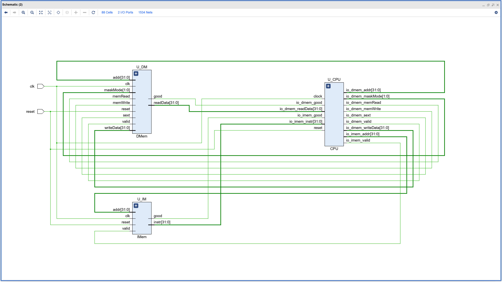
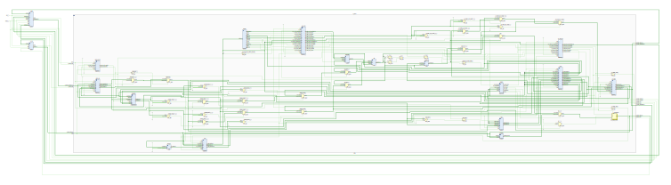
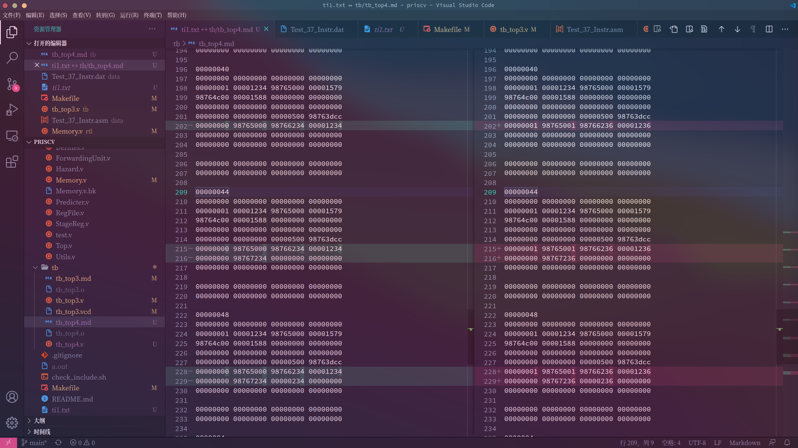
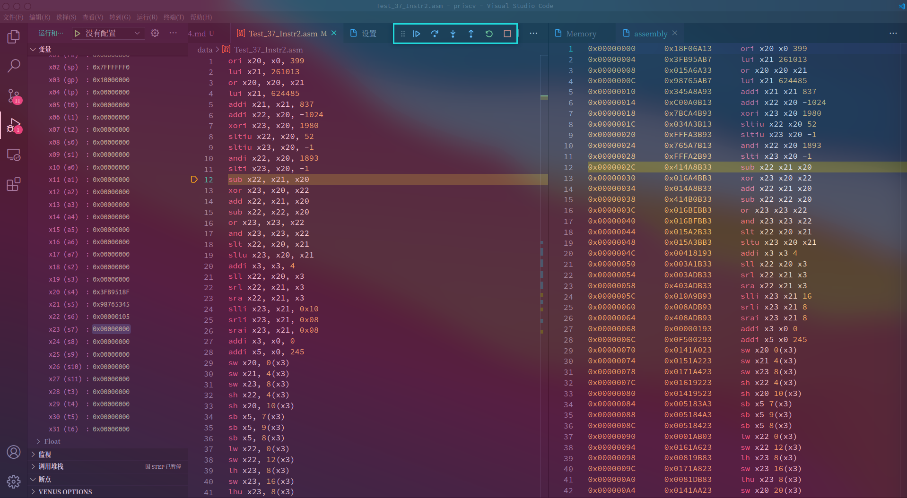

# priscv

RISC-V 五级流水线

## View





## TODO

- [x] [01] Execute 的分支跳转流水线冲刷提前，目前为从 EX_MEM 的流水线寄存器中读出 ex_mem_taken 来给 Hazard 判断冲刷，应改进为在写入 EX_MEM 之前直接给 hazard 且不冲刷 EX_MEM
  
  - 同时废弃掉 ex_mem_ctrl 的 mem_ctrl_taken  端口及寄存器
  - 修改 next_pc，接线为 Mux(id_ex_ctrl.io.data.ex_ctrl.jump(1), alu.io.aluOut, branchAdd.io.result), 去掉两处流水线寄存器 (ex_mem) 赋值和读出，增添一处上述连线、
  - ！！！注意这里有一个 trick，chisel3 在默认选项下极可能复用端口数和位宽一致的模块，把一个模块直接优化没掉，导致变量名完全不对应，dontTouch 和 dontCare 似乎不起作用

- [x] [02] 添加分支预测
  
  - Fetch 阶段解码 jal (1101111)，然后直接跳
  
  - Fetch 阶段解码 bxx, 预测为向后（低地址处）则跳，向前则不跳
  
  - 修改： 解码器 DEC_JAL 的 jump 改为 2'b00，不再跳转
  
  - 修改： branch 的流水线冲刷操作增加条件：imm[31] === 0

## Test

暂时还上不了 [riscv-tools](https://github.com/riscv/riscv-tools) 或 [riscv-tests](https://github.com/riscv/riscv-tests)，反正就 RISC-V ISA 先用点简单的

### riscv-model 随机生成汇编码或反汇编

简单地借助 [riscv-model](https://pypi.org/project/riscv-model/),用法直接参考此链接即可

十六进制文件反汇编

```bash
cd data
riscv-machinsn-decode hexstring $(cat Test_37_Instr.dat) > Test_37_Instr.asm
```

随机生成汇编码

```bash
riscv-random-asm 10
```

### pyriscv 模拟

### 全自动对比验错



### 模拟



## Others

利用的网站：

- [PDF轉PNG轉換器。在线自由 — Convertio](https://convertio.co/zh/pdf-svg/)

- [venus (cs61c.org)](https://venus.cs61c.org/)
